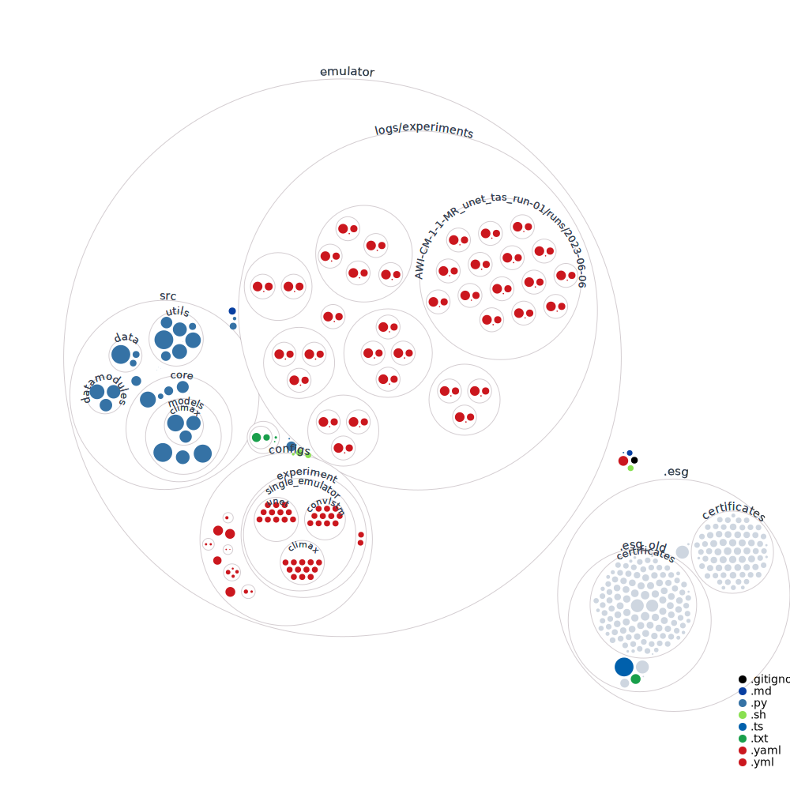

# Emulation

This branch contains the code for running the climate model emulation benchmark experiments on the core ClimateSet data. 
Here we provide a quick documentation on installation, setup and a quickstart guide to reproduce our experiments.

## Getting started
### Getting the data
The preprocessed dataset is available on [hugginface](https://huggingface.co/datasets/climateset/causalpaca). You can opt to download the entire dataset or pick only specific climate models for targets. Please note that the core dataset only entails two variables (pr & tas) and is only available in a single resouliton that was used for the benchmarking. We will release code to preprocess other variables and other resolutions shortly and will also update the data repository in the future.

To download the entire dataset, you can make use of the provided python script:
```python
python download_climateset.py
```
If you wish to download only specific climate model data, please refer to the instructions on [hugginface](https://huggingface.co/datasets/climateset/causalpaca/blob/main/README.md).

If you happen to be inside of Canada and wish to download the data in a different way, you can also make use of the provided bash script. Please note that this option is very slow for users located outside of Canada.
```bash
bash download_climateset.sh
```

#### Note that this by default only downloads NorESM2-LM data. To download data for all climate models, please uncomment the line with the for loop.

You should now see a newly created directory called "Climateset_DATA" containing inputs and targets. This folder will be referenced within the emulator pipeline. 

### Setting up the environment

To setup the environment for causalpaca, we use ```python>=3.10```. There are two separate requirements file for creating environments.

To create the environment used for training unet & convlstm models, use [requirements](requirements.txt) and climax related experiments, use [requirements_climax](requirements_climax.txt).


Follow the following steps to create the environment:

```python
python -m venv env_emulator
source env_emulator/bin/activate
pip install -r requirements.txt
cd emulator # swithc into the emulator folder to perform the emulator setup
pip install -e .
```

### For ClimaX: Download pretrained checkpoints

To work with ClimaX, you will need to download the pretrained checkpoints from the original release and place them in the correct folder. To do so, exectute the following command:

```bash
bash download_climax_checkpoints.sh
```

### Pythonpath
It might be the case that the python variable has to be modified to contain the root folder of the ClimateSet project in order for the emulator to work. Like this:

```bash
export PYTHONPATH=/home/user/myproject #ClimateSet project for example
```

You can check it the successfull setting using:
```bash
echo $PYTHONPATH
```bash

## Running a model

Please note that you will have to run everything without logger (including logger=none) at every command, or instead configure logging to your own wandb project or set up other logging methods. For that, please see the section on [logging](#logging).

### Train from scratch

To run the model, edit the [main config](emulator/configs/main_config.yaml) to fit what you want to run. 
Executing the run.py script plain will use the main config. 

The [configs folder](emulator/configs/) serves as a blueprint, listing all the modules available. To get a better understanding of our codebases structure please refer to the section on [Structure](#structure) 


```python
python run.py logger=none # will run with configs/main_config.yml
```

To exectute one of the preset experiments or to run your own experiments you can create and pass on experiment configs:

```python
python run.py experiment=test # will run whatever is specified by the configs/experiment/test.yml file
```

You can make use of the [experiment template](emulator/configs/experiment/template.yaml).


### Reproducing experiments
We provide some experiment configs in ```emulator/configs/experiment``` to recreate some of our models.

We ran 3 different configurations of experiments:
- *single emulator*: A single ML-model - climate-model pairing.
- *finetuning emulator*: A single ML-model that was pretrained on one climate-model and fine-tuned on another.
- *super emulator*: A single ML-model that was trained on multiple climate-models.

Here are some example to recreate single emulator experimnts for NorESM2-LM.

```python
python emulator/run.py experiment=single_emulator/unet/NorESM2-LM_unet_tas+pr_run-01.yaml logger=none seed=3423
```

This will train the U-Net model on NorESM2-LM dataset. To change some of the parameters of the experiment, you can use hydra to override them. For eg. to run with different experiment seed:

```python
python emulator/run.py experiment=single_emulator/unet/NorESM2-LM_unet_tas+pr_run-01.yaml logger=none seed=22201
```

For running experiments with other models, here are some example commands:

```python
python emulator/run.py experiment=single_emulator/climax/NorESM2-LM_climax_tas+pr_run-01.yaml logger=none seed=3423
```

```python
python emulator/run.py experiment=single_emulator/climax_frozen/NorESM2-LM_climax_tas+pr_run-01.yaml logger=none seed=3423
```

```python
python emulator/run.py experiment=single_emulator/convlstm/NorESM2-LM_convlstm_tas+pr_run-01.yaml logger=none seed=3423
```

For climax & climax_frozen models, we will need to use a different requirements file to create another environment.

For the single-emulator experiments, we proide configs for each ml model in ```emulator/configs/experiment/single_emulator```  and for fine-tuning experimnts, the configs can be found in ```emulator/configs/experiment/finetuning_emulator```.

For finetuning, we need to fill in ```pretrained_run_id``` and ```pretrained_ckpt_dir``` in the config files for resuming the experiments.

An example command for finetuning would look like this:
```python
python run.py experiment=finetuning_emulator/climax/NorESM2-LM_FGOALS-f3-L_climax_tas+pr_run-01.yaml seed=3423 logger=none
```

For the superemulation experiments, we provide the configs of our experiments in ```emulator/configs/experiment/superemulator```. Nothe that here, dataloiding is changed slightly to the superemulator infrastructure and a decoder must be set.

An example command to run a superemulaton experiment would look like this:

```python
python run.py experiment=superemulator/superemulator_climax.yaml seed=3423 logger=none
```
### Reloading our trained models

We provide some of our trained models from the experiments, including only superemulator experiments and single_emulator experiments performed on NorESM2-LM data. Checkpoints from all our models accumulate to a large amount of data and we are still working on making these available in a practical fashion. Please reach out to out if you wish to obtain pretrained checkpoints from any other experiment not included in this subset.


#### Downloading pretrained checkpoints

For downloading, run the provided shell script which will cretate a folder called ```pretrained_models``` where all checkpoints will be stored in.
You may uncomment experiments or models from the full list to only download a small subselection.
Be aware that the folder containing pretrained ClimaX checkpoints for the super emulator experiment is quite large (14Gb) and will take quite some time to download.
```bash
bash download_pretrained_models.sh
```


#### Running with pretrained checkpoints
If you wish to load an existing models, choose an experiment configuration, meaning superemulation, single-emulation or fine-tuning and a desired maallchine learning model. For each combinaiton you will have a choice of experiments running with different seeds. In each folder, the exact information of what data and other parameter were used, see the ```hydra_config.yaml```.

Once you selected a model, decide whether you want to adjust or freeze the model weights and extract the run id and the path of the checkpoint you want to load.

For example, you choose to reload a ClimaX model from a single emulator experiment running on NorESM-LM data. Choose a respective folder, eg. ```/pretrained_models_small/single_emulator/ClimaX/NorESM2-LM_climax_run1_single_emulator_tas+pr/``` and pick on of the run ids e.g. ```0ltetwu3```.
In the respective folder you will find one or more checkpoints stored in a ```checkpoints``` folder. Choose one and copy that path location, e.g. ```pretrained_models/single_emulator/ClimaX/NorESM2-LM_climax_run1_single_emulator_tas+pr/0ltetwu3/checkpoints/epoch=49-step=2950.ckpt```.

To retrain this model (thus fine-tuning), pass on the following arguments and the experiment config to run, or alternativeley, create a new config setting these parameters:

```yaml
# In your experiment_name.yml
model:
  finetune: True # allow further training or freeze if set to False
  pretrained_run_id: "0ltetwu3" 
  pretrained_ckpt_dir: "pretrained_models/single_emulator/ClimaX/NorESM2-LM_climax_run1_single_emulator_tas+pr/0ltetwu3/checkpoints/epoch=49-step=2950.ckpt"
```

You can also override the parameters directly when running (but pay attention, strings containing equal signs need to be put in double quotes!):

```python
python emulator/run.py  experiment=single_emulator/climax/NorESM2-LM_climax_tas+pr_run-01 logger=none model.pretrained_run_id="0ltetwu3" model.pretrained_ckpt_dir='"pretrained_models/single_emulator/ClimaX/NorESM2-LM_climax_run1_single_emulator_tas+pr/0ltetwu3/checkpoints/epoch=49-step=2950.ckpt"' model.finetune=True
```

### Reloading your own pretrained checkpoints

Similar to the fine-tuning experiments you can load, fine-tune and test preexisting models by adjusting the following parameters in the respective experiment config:

``` yaml
# In your experiment_name.yml
model:
    finetune: True
    pretrained_run_id: "" #eg "3u0ys0d5"
    pretrained_ckpt_dir: "" # eg. "causalpaca/emulator/emulator/ne8oyt48/checkpoints/epoch=49-step=2950.ckpt"
 ```


## Codebase
### Logging

#### Logging locally
To run your model locally can either use no logger at all or tell the wandb logger to log your experiments offline you will need to overwrite the default logger (wandb) and set it to offline:

Option 1: Setting loger to none
``` yaml
# In your experiment_name.yml
defaults:
  - override /logger: none.yaml
  ...
 ```
Option 2: Use wandb offline
``` yaml
# In your experiment_name.yml
logger:
    wandb:
        project: "YOUR_PROJECT"
        group: "YOUR_GROUP"
        offline: True
 ```


#### Logging to wandb

To run with logging to wandb, you can simply use the wandb logger overwriting the project and group with your project and group and set offline to False (default).

``` yaml
# In your experiment_name.yml
logger:
    wandb:
        project: "YOUR_PROJECT"
        group: "YOUR_GROUP"
        offline: False #default
 ```

#### Other logging methods

To set up other logging methods, create a new [logging config](emulator/configs/logger/) pointing to either a preimplemented class or a self-implemented class inheriting from a pytorch-lightning logger.

### Structure

The codebase is divided in two main parts, [configs](emulator/configs/) and [src](emulator/src/).
The *configs* folder provides parameterization for all the modules and experiments possible within the code provided in *src*.

Within *src*, *core* includes all the code for the training and testing pipeline, 
*data* loads and creates a custom dataset object from the core ClimateSet dataset and *datamodules* handles interfacing with the dataset for the different configurations.




### How to add new models
You can add new models in `emulator/src/core/models`. Each model should inherit from the Basemodel class you can find in `basemodel.py`. Add a new config file for your model in `emulator/config/models/`.

### How to work with the dataset only
If you wish to build your own training pipeline and just wish to make use of the dataset structure, please consider the dataset classes for either [single emulation](emulator/src/data/climate_dataset.py) or [superemulation](emulator/src/data/super_climate_dataset.py) and their respective configs ( [single](emulator/configs/datamodule/climate.yaml) and [super](emulator/configs/datamodule/climate_super.yaml).

For interfacing with pytorch lightning please consider the [single](emulator/src/datamodules/climate_datamodule.py) and [super](emulator/src/datamodules/super_climate_datamodule.py) emulation datamodules.
---

The repository is inspired by [ClimART](https://github.com/RolnickLab/climart/tree/main) and PL+Hydra template implementation [ashleve/lightning-hydra-template](https://github.com/ashleve/lightning-hydra-template)
